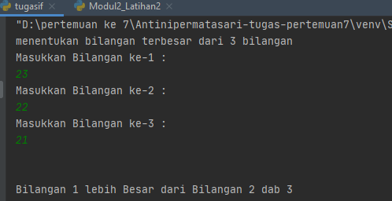
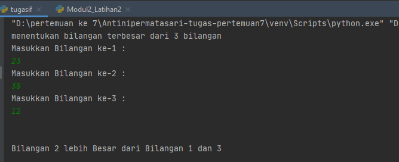
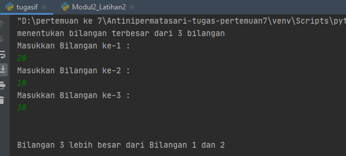
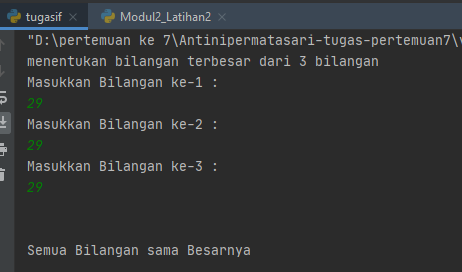

# Antinipermatasari-tugas-pertemuan7

NAMA   : Antini permatasari<br>
NIM    : 312010095<br>
KELAS  : TI.20.B.1<br>
<hr>


### menentukan bilangan Terbesar dari 3 Nilai yang diinputkan

<br>
Pada pertemuan ke-7 saya mendapatkan tugas dari Dosen Bahasa pemrograman Teknik Informatika Bapak Agung Nugroho,S.Kom.,M.kom. untuk membuat aplikasi yang menentukan bilangan terbesar dari tiga nilai yang client/user inputkan menggunakan Bahasa pemrograman.
<br>

.PNG) <br>

pada repository ini saya akan menjelaskan alur dalam *flowchart* yang telah saya buat. file *flowchat* bisa dilihat pada link berikut ini : 
[Tugas_pertemuan 7](flowchart_part7.pdf) 
<br>

Berikut source code yang saya tulis untuk menjadikan aplikasi tersebut ([Labspy02](tugasif.py)) :
<br>

```python 
 print("Masukkan Bilangan ke-1 : ")
bilangan1=int(input())
print("Masukkan Bilangan ke-2 : ")
bilangan2=int(input())
print("Masukkan Bilangan ke-3 : ")
bilangan3=int(input())
```
berikut contoh (bilangan 1>bilangan2) and (bilangan 1>bilangan3) :<br>
Dengan source code :

``` python
if ( bilangan1 > bilangan2 ) and ( bilangan1 > bilangan3 ) :
    print("Bilangan 1 lebih Besar dari Bilangan 2 dab 3")
```
Dari source code tersebut akan menghasilkan output :


<br>
* ket : <br>
kondisi ***if*** digunakan untuk mengeksekusi kode jika kondisi bernilai benar,True.
<br>
dan jika (bilangan 2>bilangan 1) and (bilangan 2>bilangan 3) :
dengan source code :


```python
elif ( bilangan2 > bilangan1) and ( bilangan2 > bilangan3 ) :
    print ("Bilangan 2 lebih Besar dari Bilangan 1 dan 3")
```
Dari source code tersebut akan menghasilkan output :

<br>
<br>

Selanjutnya jika (bilangan 3>bilangan) and (bilangan 3>bilangan 2) dengan source 
 code/syntax :
 
 ```python
elif (bilangan3 > bilangan1) and (bilangan3 > bilangan2 ) :
    print ("Bilangan 3 lebih besar dari Bilangan 1 dan 2")
```
Dari source code tersebut akan menghasilkan output :

<br>
* Ket : <br>
pengambilan keputusan **(kondisi if elif)** merupakan lanjutkan/percabangan logika dari 
***kondisi if***. Dengan elif kita bisa membuat kode program yang akan menyeleksi
beberapa kemungkinan yang bisa terjadi.

jika semua bilangan bernilai sama kita akan menggunakan kondisi ***else*** dengan source
code berikut : <br>
```python
else :
    print ("semua Bilangan sama Besarnya")
```

Dari syntax tersebut akan menghasilkan output : <br>

<br>
* ket : <br>
***kondisi if else*** adalah kondisi dimana jika pertanyaan benar *True*, maka kode didalam if akan dieksekusi, tetapi jika bernilai salah *False* maka akan mengeksekusi kode didalam else.

### ***==========Tank you ================***
### ***====== Tugas pratikum 2_modul 2==***
### ***======Repository_labspy02=======***
### ==***Antini permatasari-312010095***==
###======================================